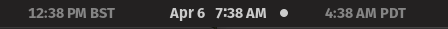

# ManyClock 
## A GNOME-Shell extension which adds two clocks

I modified the original project [MultiClock](https://github.com/mibus/MultiClock) that displayed a second clock in the top Panel Menu. I've added code to display two clocks because I have two distributed teams that I work with. 

Currently this extension explicitly creates two additional clocks (designed to appear on either side of the default clock if it is centered), each configurable to a separate timezone. In the future, I would like to add additional logic to configure the number of clocks.  

<div style="text-align:center"></div>

<!--  -->

## Configuration

Click on the displayed "alternate" time to select from presets or to add your own `tz` named timezone. Selected timezones from the dropdown are saved for future logins.

| Clock 1 Settings | Clock 2 Settings |
|--- | --- |
|![alt text][config_1] | ![alt text][config_2]|

[config_1]: assets/config_1.png
[config_2]: assets/config_2.png

## Installation
### Using extensions.gnome.org/
Coming soon!

### Manual Installation

```
git clone git@github.com:brianrudolf/ManyClock.git ~/.local/share/gnome-shell/extensions/ManyClock@brianrudolf
gnome-extensions enable ManyClock@brianrudolf
```
You may need to restart GNOME Shell by pressing `Alt+F2` to open the Run Dialog and enter restart (or just r) 

## Development

Just edit the files in ~/.local/share/gnome-shell/extensions/ManyClock@brianrudolf/.

Under X11, using `Alt+F2` to run `r` will cause a gnome-shell reload (and thus pick up the edited extension).

Under Wayland, there's no ability to reload just gnome-shell, so you're better off doing development in a nested environment that you can readily restart:

```
dbus-run-session -- gnome-shell --nested --wayland
```

## License

This extension is distributed under the terms of the GNU General Public License, version 2 or later. See the LICENSE file for details.
